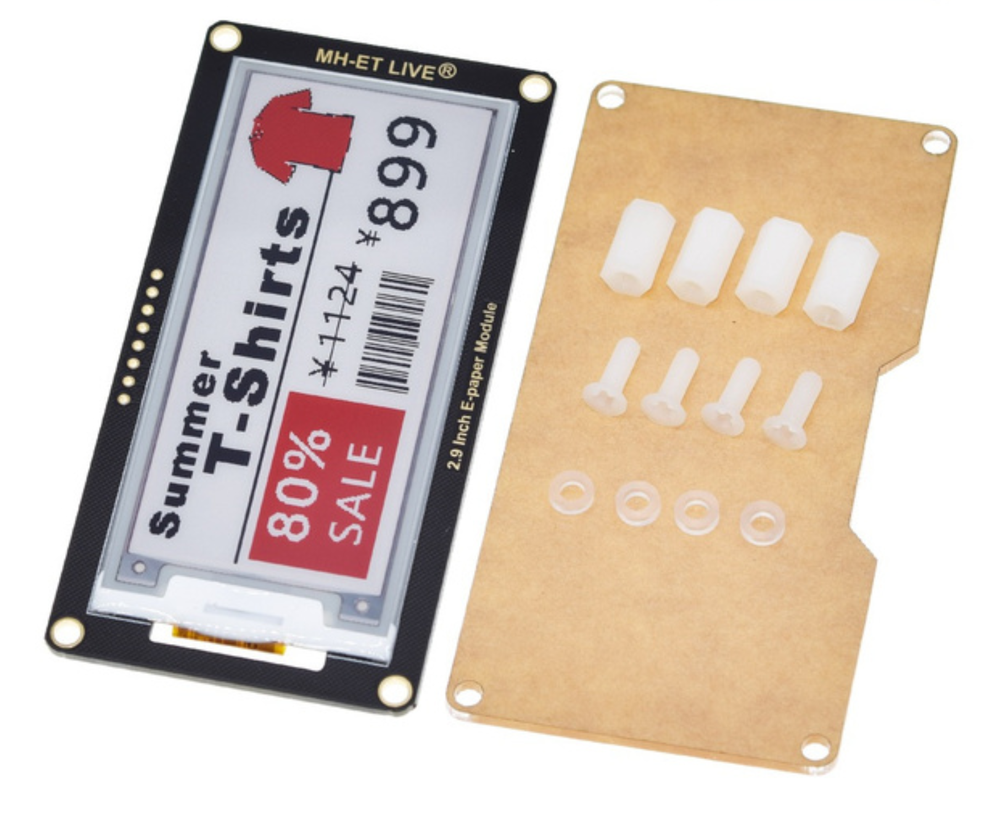

MH-ET LIVE 2.9 inch e-paper example

Example using gxepd2 library on Arduino UNO with this e-paper display: 

https://www.aliexpress.com/item/1005002241587270.html

Mapping for UNO:
BUSY -> 7, RST -> 9, D/C -> 8, CS-> 10, SCLK -> 13, SDI -> 11
